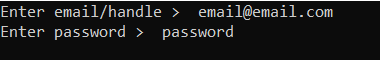

# cf-contest-reg-selenium
using selenium to register for codeforces contests.

# Requirements - 
* Selenium 
* Google Chrome
* chromedriver.exe

# Steps -
* open script.py
* enter email & password 
* Done! The program will register for the most recent available contest.
